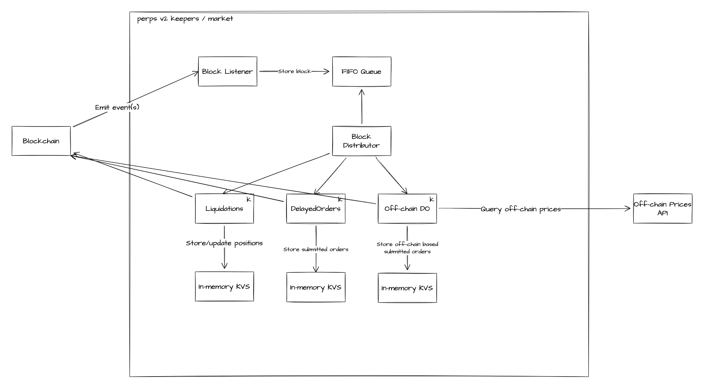

# perps-keepers

**Welcome to perps-keepers!**

> **Note**
> PLEASE _ONLY_ USE THIS REPOSITORY AS AN EXAMPLE TO BUILD YOUR OWN KEEPER.

This repository houses Synthetix Perps keepers to maintain the health and provide a better UX for traders on frontends such as Kwenta and Decentrex. `perps-keepers` provides 3 main functions. These include:

1. Liquidation of underwater positions
1. Execution of delayed orders
1. Execution of off-chain delayed orders

This project is a [fork of futures-keepers](https://github.com/Synthetixio/futures-keepers). The internals around liquidations remain largely the same but has undergone significant code restructure and now supports delayed and off-chain orders in addition to just liquidations.

## Overview



`perps-keepers` architecture is fairly simple. A block listener consumes events from the blockchain (Optimism) and inserts the block number into an in-memory first-in-first-out (FIFO) queue to be consumed by a block distributor. The block distributor queries for events and distributes relevant events each keeper.

## Configuration

Variables for configuration are defined as environment variables. During development they are stored in an `.env.staging` file at the project root then loaded via [dotenv](https://www.npmjs.com/package/dotenv). The contents are as follows:

| Variable                       | Required | Description                                                        | Default                               |
| :----------------------------- | :------- | :----------------------------------------------------------------- | :------------------------------------ |
| `ETH_HDWALLET_MNEMONIC`        | Yes      | Mnemonic used to unlock the keeper's wallet                        |                                       |
| `PROVIDER_API_KEY_INFURA`      | Yes      | Infura RPC provider API key                                        |                                       |
| `PROVIDER_API_KEY_ALCHEMY`     | No       | An optional Alchemy RPC API key to fallback if Infura falls key    |                                       |
| `NETWORK`                      | No       | Network to keep against (goerli-ovm, mainnet-ovm)                  | optimism-goerli                       |
| `FROM_BLOCK`                   | No       | Default block to index from                                        | 1                                     |
| `SIGNER_POOL_SIZE`             | No       | Number of accounts from ETH_HD_WALLET to use as signers            | 1                                     |
| `SIGNER_POOL_MONITOR_INTERVAL` | No       | Amount of time between signer monitor in ms                        | 600000                                |
| `DISTRIBUTOR_PROCESS_INTERVAL` | No       | Number of ms to wait before processing the next batch of blocks    | 3000                                  |
| `MAX_ORDER_EXEC_ATTEMPTS`      | No       | Maximum number of order execution attempst to try before ignoring  | 10                                    |
| `METRICS_ENABLED`              | No       | Metrics enabled/disabled (1 = enabled, everything else = disabled) | 0                                     |
| `PYTH_PRICE_SERVER`            | No       | Off-chain HTTP API endpoint sued to fetch Pyth oracle prices       | https://xc-testnet.pyth.network       |
| `LOG_LEVEL`                    | No       | Application log level                                              | info                                  |
| `AUTO_SWAP_SUSD_ENABLED`       | No       | Whether to swap sUSD rewards for ETH (via 1inch)                   | 0                                     |
| `AUTO_SWAP_MIN_SUSD`           | No       | Minimum amount of sUSD before swapping no 1inch                    | \$50 USD (10^18)                      |
| `AUTO_SWAP_INTERVAL`           | No       | Amount of time between to wait between swapping                    | 24hrs (ms)                            |
| `ENABLED_KEEPERS`              | No       | A list of keeper types to enable for execution                     | DelayedOrder,OffchainOrder,Liquidator |

_For an example `.env` see `.env.example`. All input variables are validated, see `./src/config.ts` for more details (including defaults). Speak with another developer for `.env` values._

## Development

```bash
# Clone the repository.
git clone git@github.com:Synthetixio/perps-keepers.git

# Install project dependencies.
npm i

# Execute keeper locally (testnet)
npm run dev

# Execute keeper (mainnet)
npm run dev:mainnet
```

_See configuration section above before attempting to run locally._

### Local Node

```bash
# Start your local node
hardhat node --fork https://optimism-goerli.infura.io/v3/<infura key>`
```

```bash
# Fund one of the test wallets.
git clone git@github.com:Synthetixio/synthetix.git

npm i
npx hardhat fund-local-accounts --provider-url http://127.0.0.1:8545/ --target-network goerli-ovm --deployment-path ./publish/deployed/goerli-ovm/ --use-ovm --private-key $GOERLI_OVM_PERPS_DEPLOYER_PRIVATE_KEY --account 0x8626f6940e2eb28930efb4cef49b2d1f2c9c1199

# 0x8626f6940e2eb28930efb4cef49b2d1f2c9c1199` is one of the default accounts from hardhat node --fork
```

### Deployment

Any host environment with NodeJS installed running a Unix based operating system can execute `perps-keepers`. It's recommended to use some external service tool to monitor the runtime health of your keeper instance for self-healing purposes.

For example, spinning up a Kubernentes cluster and relying on k8's `deployment` group configuration, classical AWS AMIs in an ASG (auto-scaling) or even something as simple as `pm2`.

### Metrics & Alerts

```
METRICS_ENABLED=1
```

`perps-keepers` uses basic custom CloudWatch metrics throughout the application to track the health of the keeper. These metrics and then be used to configure alerts for notifications. Metrics are disabled by default. They require AWS credentials to be defined and `METRICS_ENABLED=1` to be set. You can find the list of all available custom metric in `./src/metrics.ts`.

### CI/CD

This project's continuous integration/deployment process is managed via GitHub actions. They can be found under the `.github/` directory. In short,

- Merge/Push to branch `develop` will trigger a staging release and start the keeper on `ovm-goerli`
- Merge/Push to branch `master` will trigger a production release and start the keeper on `ovm-mainnet`

To set this up as a fork we need to create GitHub secrets for all required environment variables.
